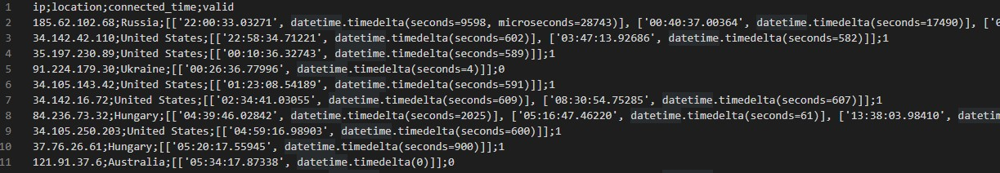
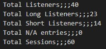

# Lahmacun Radio Analytics

Lahmacun is a community music webradio based in Budapest.

## Objective
1. Use the radio streaming server's (an Azuracast instance) `listeners` API response to collect and derive listening stats. 
2. Get number of unique listeners per day:
    + fetch AzuraCast API
    + store relevant data in a Python dictionary
    + automate API snapshot twice every minute to update dictionary
    + automate export to csv + return of total "long" and "short" listeners every n hours
3. Get total listened time per show per week (future work)

## Dependencies

### 1. Create a virtual environment : 
+ on Linux/Mac OS: 

        python3 -m venv virtual
+ on Windows:

        python -m venv virtual
        
### 2. Activate the virtual environment :
+ on Linux/Mac OS : 
        
        source virtual/bin/activate
+ on Windows :

        virtual/Scripts/activate
        
### 3. Install the necessary librairies :

        pip install -r requirements.txt

## Usage
Methods from *API_autoFetcher.py* can be called through the command line, like so:

    $ python fetcher.py <n_hours>

**<n_hours>** : determines the occurrences of exports (in hours).

## Output file specification

### **Listeners and sessions**

The periodic csv has the following structure: 

Each row contains the IP address of the listener (`ip`), the country based on this address (`location`), an array of listening sessions for the listener (`connected_time` where every element of the array is another array containing the starting time and the length of the session), and a validity flag for long listing sessions (`valid` where 1 if there was at least one session lasting more than 5 minutes, 0 otherwise). 

Note that the starting time is returned in an `hours:minutes:seconds.microseconds` format. 

If the location cannot be determined (due to missing data in the API response of Azuracast), then the row's location shows `N/A`. Note that, in this case, a distinct IP address is usually unknown and, as a result, multiple distinct users may be mapped to the same generic IP address. 

### **Aggregated results**

In the end of each csv file, the an aggregation block is computed such as: 

`Total Listeners` means the number of all listening sessions, `Total Long Listeners` means the number of sessions longer than 5 minutes, `Total Short Listeners` means the number of sessions less than 1 minutes, `Total N/A entries` means the number of unknown users (again, the real number of listeners may be more), and `Total Sessions` means the total number of listening sessions (formally, the number of tuples in all `connected_time` arrays). 

### **Example**

[example_daily.csv](/examples/example_daily.csv) shows a complete example output file for a day's traffic. 

